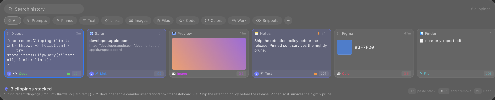
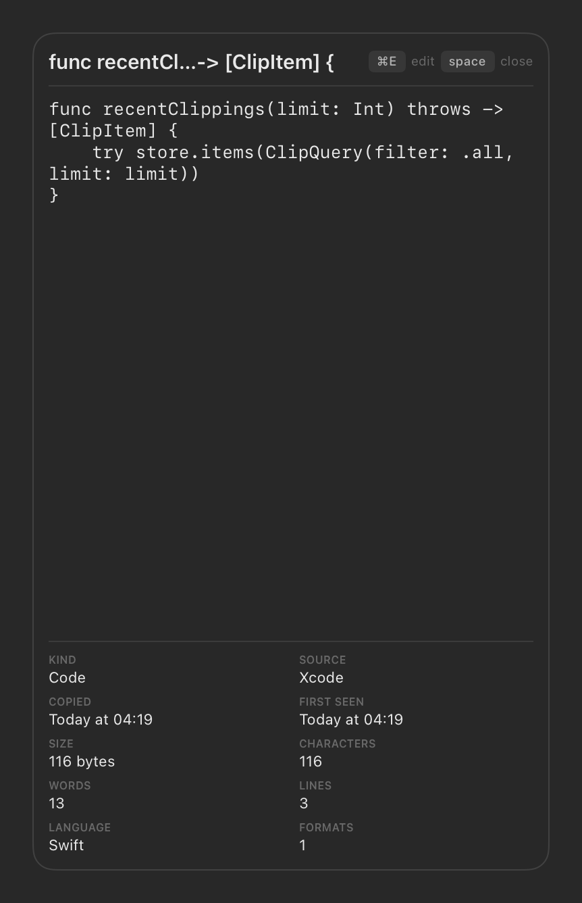

# PasteDeck

A clipboard history manager for macOS. Press **⌘⇧V**, pick a clipping, it pastes
into whatever you were just doing.


Everything stays on your machine. No network code, no accounts, no dependencies
— one binary under 3 MB and the SQLite that ships with macOS.

- Full history — text, links, code, colours, images, files
- Shows which app each clipping came from, plus its metadata
- Full-text search across everything
- Persistent categories, plus pinning
- Old items pruned automatically so the database can't grow forever
- Starts at login, lives in the menu bar, no Dock icon

## Built for pasting into an LLM

Copying an error, then the function, then the docs — one at a time into a chat
window — is most of what using a model looks like. Two features collapse that.

### Stack clippings with `⇧↩`



`⇧↩` gathers instead of pasting. Gathered cards turn indigo and get a number;
`↩` then pastes all of them as one block, each part labelled by kind and source
app:

````
### Text · Terminal
TypeError: cannot read property 'id' of undefined

### Code · Ghostty
```swift
let user = users.first { $0.id == target }
```
````

The headings are the point — three anonymous blobs make the reader guess which
is the error. Code is fenced, with the language when it's known, and the fence
grows past any backticks already in the clipping. A stack of one pastes exactly
like choosing that clipping normally would.

### Prompts with fill-in slots


A library of text you wrote rather than copied. `⌘⇧N` writes one, `⌘E` promotes
any clipping into one. Wrap a word in double braces and PasteDeck asks for it
before pasting, with the rendered result updating as you type.

Two slots fill themselves and never appear as fields — `{{clipboard}}` and
**`{{stack}}`**, which is where the two features meet. Gather the context, pick
the prompt that wraps it, done in two keystrokes.

### Read and edit any clipping



`space` opens the selected clipping as a page — shaped for reading rather than
for the deck, so it's its own window at the golden ratio. The arrows keep paging
while it's open. `⌘E`, or a click on the text, makes it editable; `⌘↩` saves.

## Install

Requires macOS 14+ and the Swift toolchain (Command Line Tools are enough — no
Xcode needed).

```sh
make install    # builds, copies to /Applications, launches it
make run        # build and run without installing
make test       # 84 tests
```

Then grant **System Settings ▸ Privacy & Security ▸ Accessibility** so it can
press ⌘V for you. Everything else works without it.

## Keys

| | |
|---|---|
| `⌘⇧V` | open the deck |
| `←` `→` `⇥` | move within a row |
| `↑` `↓` | move between search, categories, cards |
| `↩` | paste — the stack if there is one, else the selected clipping |
| `⇧↩` | add / remove from the stack |
| `⌘1`–`⌘9` | paste the nth clipping |
| `space` | open as a page |
| `⌘E` | edit the page, or save a clipping as a prompt |
| `⌘⇧N` | new prompt |
| `⌘P` / `⌘⌫` | pin / delete |
| `⎋` | back out one layer at a time, then close |

## More

[`docs/manual.md`](docs/manual.md) covers the storage model, the retention
policy, the design system, and why an ad-hoc build loses its Accessibility
grant on every rebuild.
