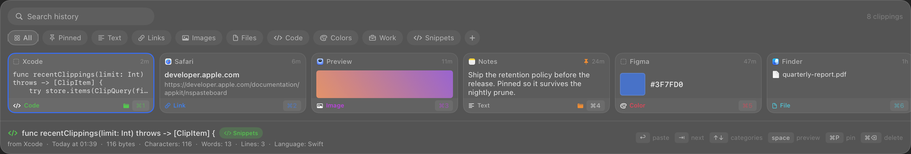

# PasteDeck — manual

A native macOS clipboard manager: full history, categories that persist, search,
media support, and source-app attribution. Press **⌘⇧V** and the deck slides up
from the bottom of the screen.



Written in Swift (AppKit + SwiftUI) with **zero third-party dependencies**.
History lives in a local SQLite database. There is no networking code in the app.

---

## Install

Requires macOS 14 or newer and the Xcode Command Line Tools (`xcode-select --install`).
A full Xcode install is *not* needed.

```sh
make install     # builds, copies to /Applications, launches
```

Or just build and run from the repo:

```sh
make run         # builds dist/PasteDeck.app and opens it
```

On first launch PasteDeck offers to open **System Settings ▸ Privacy & Security ▸
Accessibility**. Granting it lets PasteDeck press ⌘V for you after you pick an
item. Everything else — recording, searching, copying — works without it.

Without it, Enter and clicking a card still put the clipping on the clipboard,
but nothing lands in the app you came from. The deck stays open and says so
rather than looking like the key did nothing.

**An ad-hoc build loses that grant every time you rebuild** — see
[Accessibility and code signing](#accessibility-and-code-signing).

To start it automatically: **Settings ▸ General ▸ Start PasteDeck at login**.

## Using it

| Key | Action |
|---|---|
| `⌘⇧V` | Open / close the deck (re-bindable in Settings) |
| `←` `→` | Move through clippings |
| `↩` | Paste into the app you came from |
| `⌘C` | Copy without pasting |
| `⌘1`…`⌘9` | Paste the *n*-th clipping |
| `⇧↩` | Add / remove the clipping from the stack |
| `space` | Open the clipping as a page, with full metadata (arrows keep paging) |
| `⌘E` (page open) | Edit the text on the page |
| `⌘↩` / `⎋` (editing) | Save the edit / discard it |
| `⌘P` | Pin (pinned items are never pruned) |
| `⌘⌫` | Delete the clipping |
| `⇥` / `⇧⇥` | Next / previous category |
| `↑` `↓` | Cycle search → categories → cards, wrapping (empty categories skip the cards) |
| `⌘N` | New category |
| `⌘⇧N` | New prompt |
| `⌘E` | Edit the prompt, or save any clipping as one |
| `⌘,` | Settings |
| `esc` | Close the preview, clear the stack, clear the search, then close |

Type anything to search — the field has focus the moment the deck opens.
Right-click a card for stacking, pinning, categories, *Save as Prompt*,
*Copy as Plain Text*, *Open Link*, *Reveal in Finder*, and delete.

### Editing a clipping

Press `space` to open the page, then `⌘E` — or just click the text. `⌘↩` saves,
`⎋` discards. Closing the deck mid-edit saves rather than dropping what you
typed.

Only kinds whose content *is* plain text can be rewritten: text, code, links and
prompts. **Rich text is deliberately read-only** — its payload is RTF or HTML,
and saving edited plain text over it would silently discard the formatting that
makes pasting back into the originating app worth anything. Images, files and
colours have no prose to edit.

Saving rewrites the clipping in place, keeping its id, pins and categories, and
replacing every stored representation with the new text. Everything derived
gets recomputed: title, preview, search index, byte size, counts, a link's host,
a code snippet's language, a prompt's slots.

Two things stay put on purpose. The **kind never changes** — editing a note
until it happens to look like code shouldn't move it to another tab under the
cursor. And **`updated_at` is preserved**, so the card doesn't jump to the front
of a strip you're reading; the deck sorts by when things were *copied*, and
editing isn't copying.

If an edit would make the clipping byte-identical to another one, it's refused
with a message rather than failing on the unique content hash.

### Stacking

`⇧↩` gathers clippings instead of pasting one. Each gathered card turns indigo
and gets a number; the bar at the bottom counts them and lists them in order.
`↩` then pastes the whole stack as one labelled block:

````
### Text · Terminal
TypeError: cannot read property 'id' of undefined

### Code · Ghostty
```swift
let user = users.first { $0.id == target }
```
````

The headings are the point. Three anonymous blobs pasted into a chat make the
reader guess which is the error and which is the code; naming each part by kind
and source app is the reason to stack rather than paste three times.

Code blocks are fenced, with the language when it's known, and the fence grows
past any backticks already in the clipping so a snippet can't break out of its
own block. A stack of one pastes exactly like choosing that clipping normally
would — no heading, no wrapper. Images can't be stacked; there's no text in them
to contribute. The stack empties when the deck closes, since it describes one
errand rather than a saved selection.

### Prompts

The **Prompts** tab is a library of text you wrote rather than copied. Write one
with `⌘⇧N`, or press `⌘E` on any clipping to promote it into one.

Wrap a word in double braces to make it a slot:

```
Rewrite the following for {{audience}}. Keep it {{tone}}.

{{clipboard}}
```

Choosing that prompt opens a small sheet asking for *audience* and *tone*, with
the rendered result updating underneath as you type. `⇥` moves between fields,
`↩` pastes, `⎋` backs out. Two slot names fill themselves in and are never shown
as fields:

| Slot | Filled with |
|---|---|
| `{{clipboard}}` | Whatever is on the clipboard right now |
| `{{stack}}` | Everything currently stacked, composed as above |

Slot names are case-insensitive and may contain spaces, so `{{Target Audience}}`
and `{{target audience}}` are one field. Anything between braces that isn't a
well-formed name — `{{2 + 2}}`, an unclosed `{{` — is left exactly as written
rather than silently vanishing on paste.

`{{stack}}` is where the two features meet: gather an error, the function that
threw it and the relevant docs with `⇧↩`, then choose your *Debug with context*
prompt. One keystroke sends what used to be three copy-paste round trips.

Prompts are ordinary rows in the same table, so search, categories and metadata
all work on them. Two things differ: they're **never pruned**, whatever the
retention settings say, and they're kept out of All, Pinned and the kind filters
— a template library mixed into "everything you copied" buries the history.
Four starter prompts are installed on first launch; delete them and they stay
deleted.

### Categories

Two kinds share the same bar:

- **Smart** — All, Prompts, Pinned, Text, Links, Images, Files, Code, Colors.
  These are live filters over the whole history, except Prompts, which is the
  library described above.
- **Yours** — created with `⌘N` or the `+` chip. Filing a clipping into one makes
  it **permanent**: user categories and pins are exempt from every retention rule.

### What gets recorded

Every representation of every copy — plain text, RTF, HTML, PNG/TIFF/JPEG, file
URLs, colours, and app-private formats — so pasting back into the originating app
is byte-identical rather than downgraded to plain text.

Each clipping stores the app it came from (icon and name), when it was first and
last seen, how many times you've pasted it, its size, and kind-specific metadata:
pixel dimensions, character/word/line counts, URL host, file paths, hex value.

### What doesn't

- Pasteboards flagged `org.nspasteboard.ConcealedType` — password managers set
  this, so credentials are skipped.
- Transient and auto-generated pasteboards.
- Anything from an app on your ignore list (**Settings ▸ Privacy**).
- PasteDeck's own writes.

## Keeping storage bounded

**Settings ▸ History** sets three independent limits, each defaulting to
something sane and each settable to *No limit*:

| Limit | Default |
|---|---|
| Number of clippings | 2 000 |
| Age | 30 days |
| Disk used | 2 048 MB |

Pruning runs at launch, every 30 minutes, and on demand. It removes the oldest
clippings first and **never** touches pinned or filed ones. Payloads over 64 KB
live in a content-addressed blob store (`blobs/ab/cd/<sha256>`), so two copies of
the same screenshot occupy one file; unreferenced blobs are garbage collected on
the same schedule.

Memory stays flat regardless of history size: the deck reads one page of rows and
pulls thumbnails lazily, never full payloads.

Everything is under `~/Library/Application Support/PasteDeck/`.

## Development

```sh
make build    # compile every target
make test     # 84 unit tests: store, classifier, retention, prompts, editing
make app      # assemble dist/PasteDeck.app
make run      # build, replace the running copy, launch
make icon     # regenerate Resources/AppIcon.icns
```

Command Line Tools ship neither XCTest nor swift-testing, so the suite is a plain
executable with a small harness in `Tests/CoreTests/Harness.swift`.

Render the UI offscreen without launching anything. The renderer seeds its own
throwaway store, so nothing from your real history reaches the image — which is
what makes these safe to commit as screenshots.

```sh
swift run PasteDeck --render-preview out.png                 # the deck
swift run PasteDeck --render-preview out.png --tab prompts   # a filter tab
swift run PasteDeck --render-preview out.png --stack 3       # stack mode
swift run PasteDeck --render-preview out.png --search zzz    # the empty state
swift run PasteDeck --render-preview out.png --zone search   # a focus ring
swift run PasteDeck --render-preview out.png --large code    # the page
swift run PasteDeck --render-preview out.png --large --edit  # editing it
swift run PasteDeck --render-preview out.png --fill          # a prompt's slots
```

`--fill` is the one exception: `{{clipboard}}` resolves against the real
pasteboard, so check what's on it before using that one for a screenshot.

### Layout

```
Sources/PasteDeckCore/     Foundation only — unit-testable, no AppKit
  Model/                   ClipItem, ClipKind, ClipCategory, metadata
  Store/                   SQLite wrapper, schema + FTS5, ClipStore, blobs, retention
  Capture/                 Pasteboard snapshot, classifier, text/image analysis
  Settings/                Preferences, on-disk paths
Sources/PasteDeck/         The app
  Clipboard/               Pasteboard monitor, paste-back, source-app attribution
  System/                  Carbon hot key, Accessibility, login item
  UI/                      Deck panel, cards, category bar, detail bar, settings
Tests/CoreTests/           Test harness + suites
scripts/                   .app bundler, icon generator
```

### Design notes

- **Polling, not notifications.** macOS has no pasteboard-change notification;
  `changeCount` is polled every 0.35 s (configurable). It's an integer read.
- **Carbon for the hot key.** `RegisterEventHotKey` needs no permissions, unlike
  a `CGEventTap`, so the deck opens the moment you install it.
- **Non-activating panel.** The deck takes keyboard focus without stealing the
  menu bar; the app you came from is remembered and re-activated on paste.
- **External-content FTS5.** The search index is kept in sync by triggers, so it
  can never drift from the `items` table.
- **One radius formula.** `radius(container) = radiusTile + its own padding` —
  the concentric rule `inner = outer − inset` read from the inside out. Starting
  from a 4 pt tile that gives cards `4 + 8 = 12` and the panel `4 + 12 = 16`, so
  curves stay parallel however deep the nesting goes. Deriving the panel from
  the *card* instead (`12 + 12 = 24`) double-counts: cards sit in the middle of
  the panel and never touch its corners, and the panel ends up rounder than
  anything in it, crowding the search field and the meta bar that do live there.
  Pills are the exception — their radius is half their height by definition, so
  `Theme.pillPadding(_:)` derives their side padding from their height instead.
- **The panel height is a sum, not a measurement.** Every section has a fixed
  height and `Theme.deckHeight` adds them up (12 + 28 + 8 + 24 + 12 + 144 + 12 +
  1 + 52 = 293), so the hosting window can't crop a row or leave dead space.
  `design/layout-workbench.html` derives the same numbers from the same formula.
- **φ is for rectangles, not for systems.** Two things in the deck are a
  rectangle with a free aspect ratio, and both are golden: the preview page, and
  the card at 232 × 144 (232 ÷ φ = 143.4, and 144 is 36 units — a 0.4 % miss, so
  φ and the 4 pt grid happen to agree). Nothing else uses it, deliberately.
  4 × φ = 6.47 and 4 × φ² = 10.47 leave the grid, which costs pixel alignment
  and breaks the radius formula — `radiusCard` would land on 14.47. And the
  panel height is a *sum*, while the search field's width is set by having to
  align with the first card. Neither is a proportion anyone gets to choose.
- **Seven type sizes, not fourteen.** The deck accumulated fourteen font sizes,
  six of them separated by half a point — a distinction nobody can see and
  everybody has to maintain. `Theme.caption/small/body/large/title/display/hero`
  are steps of φ^⅓ ≈ 1.174 from an 11 pt body (full φ is unusable for interface
  text: 11 → 17.8 → 28.8). The ratio matters less than the count; the names are
  what stop it drifting back, since a raw `size: 12` is how the fourteen got in.
- **The large preview is a second window.** The deck is a 293 pt strip along the
  bottom of the screen, so anything drawn *inside* it is a letterbox however
  it's laid out — the wrong shape for reading. The preview gets its own panel,
  sized to the golden ratio and centred in the band above the deck. It never
  becomes key, so the deck keeps the keyboard and space, escape and the arrows
  work unchanged; the arrows page through clippings with it still open.
- **Empty zones aren't reachable.** ↑ / ↓ cycle the search field, category bar
  and card strip, but the strip drops out of the cycle when it's empty rather
  than becoming a dead end that swallows the cursor and shows no ring anywhere.
- **The preview borrows the keyboard, briefly.** A text view can't receive
  keystrokes in a window that can't become key, so editing flips the preview
  panel's `canBecomeKey` on and hands it straight back on save or cancel. The
  deck's click-away dismissal has to ignore *that* resign — it's our own window,
  not the user leaving — and the hand-over is deferred one run-loop turn because
  `@Published` fires in `willSet`, so the flag the dismissal checks hasn't
  landed yet at the moment the publisher runs.
- **One colour means focus.** The accent ring marks whatever the arrows are
  steering — a card, a category chip, or the search field — and dims on the
  other two. Category tints say *which filter*; the accent says *where you are*.

## Accessibility and code signing

An ad-hoc signature (`codesign -s -`, the default here) gives the app no
identity of its own, so the requirement macOS files alongside the Accessibility
grant is the code hash itself:

```
$ codesign -d -r- /Applications/PasteDeck.app
designated => cdhash H"13dd4f8cc712ee6364084db62e08ee1265e0e8d7"
```

Every rebuild changes that hash. The grant then matches nothing — but the row
stays in System Settings with its switch still on, so the app looks authorised
and silently can't press ⌘V. `make install` therefore runs
`tccutil reset Accessibility app.pastedeck`, which puts the switch back to off
where it belongs so you can grant it again and see that you did.

To stop re-granting after every build, sign with a real identity — its
requirement is the same before and after:

```sh
make signing-cert                                  # once; asks for your password
SIGN_IDENTITY="PasteDeck Local Signing" make install
```

That creates a self-signed code-signing certificate in your login keychain and
trusts it for code signing. Delete "PasteDeck Local Signing" in Keychain Access
to undo it. Any Developer ID or Apple Development identity works just as well.

## Caveats

- Source-app attribution uses the frontmost app at copy time. Copies made by a
  background script are attributed to whatever was in front.
